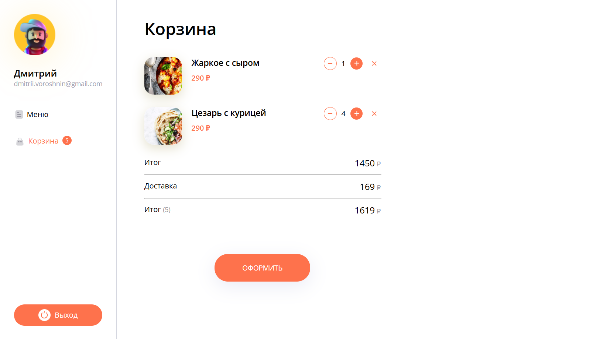

# Food Delivery

**Food Delivery** — это веб-приложение для заказа блюд с удобным интерфейсом, созданное для кафе и ресторанов, чтобы упростить процесс онлайн-заказов для своих клиентов. Приложение разработано с использованием **React**, **TypeScript**, **CSS-модулей** и **Redux Toolkit** для эффективного управления состоянием и интуитивной навигации.

## Основные возможности

- **Меню** — отображает каталог доступных блюд с фотографиями, описанием и ценами, что позволяет клиентам легко выбирать блюда.
- **Карточка блюда** — подробная страница с информацией о каждом блюде, включая ингредиенты и цену, с возможностью добавления блюда в корзину.
- **Корзина** — пользователи могут просматривать свои заказы, редактировать количество блюд и видеть итоговую стоимость перед оформлением заказа.
- **Регистрация и вход** — функционал для создания учетной записи и входа в систему.
- **Подтверждение заказа** — после оформления заказа клиент получает уведомление о его успешной обработке.
- **API** — приложение использует API для загрузки списка блюд и отправки меню, что упрощает интеграцию с базой данных и автоматизирует обновление данных.
- **Работа с API** — для тестирования и отладки API использовалась **Insomnia**, что позволило убедиться в корректности работы всех запросов.

## Скриншоты

### Меню

Меню с широким выбором блюд, включая фотографии, цены и краткое описание для каждого из них.

### Карточка блюда

Подробная информация о блюде с возможностью добавления в корзину.

### Корзина

Корзина, где пользователи могут видеть итоговую стоимость заказа и редактировать его перед подтверждением.

### Вход и регистрация

Страницы для входа и регистрации пользователей, чтобы сделать процесс заказа более персонализированным.

### Подтверждение заказа

Экраны, подтверждающие успешное оформление заказа с приглашением к дальнейшим заказам.

## Стек технологий

- **React** — библиотека для создания удобного пользовательского интерфейса.
- **Redux Toolkit** — для управления глобальным состоянием приложения.
- **TypeScript** — для типизации и повышения надежности кода.
- **CSS-модули** — для стилизации компонентов и улучшения производительности.
- **localStorage** — для хранения состояния корзины и данных пользователя.
- **API** — для загрузки данных блюд и отправки заказов.
- **Insomnia** — инструмент для тестирования и отладки API-запросов.

## Контакты

- **Email:** vorosdmi@gmail.com
- **Whatsapp (RUS):** [Дмитрий 79823455042](https://wa.me/79823455042)
- **Whatsapp (EN):** [Dmitrii 34663409076](https://wa.me/34663409076)
